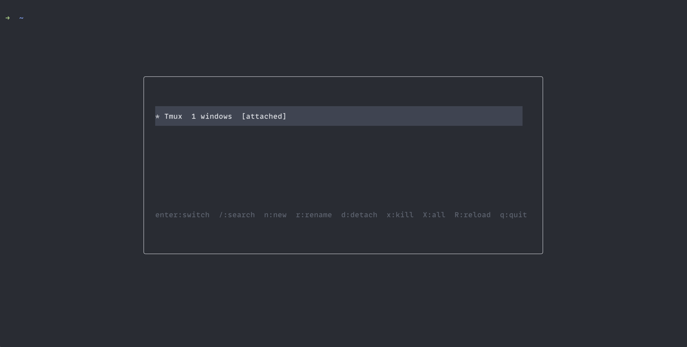

# tmux-pilot

A lightweight, dependency-free session manager for tmux.




## Features

- **Zero dependencies** - Pure bash, no fzf or other tools required
- **Real-time search** - Filter sessions as you type
- **Vim-style navigation** - Use `j`/`k` to move up and down
- **Session management** - Create, rename, kill sessions without leaving the popup
- **Customizable** - Configure keybinding, width, and height

## Installation

### Using TPM (recommended)

Add to your `~/.tmux.conf`:

```bash
set -g @plugin 'VheissuLabs/tmux-pilot'
```

Then press `prefix + I` to install.

### Manual

Clone the repo:

```bash
git clone https://github.com/VheissuLabs/tmux-pilot ~/.tmux/plugins/tmux-pilot
```

Add to your `~/.tmux.conf`:

```bash
run-shell ~/.tmux/plugins/tmux-pilot/pilot.tmux
```

## Keybindings

| Key | Action |
|-----|--------|
| `Enter` | Switch to selected session |
| `/` | Search sessions (real-time filtering) |
| `n` | Create new session |
| `r` | Rename selected session |
| `d` | Detach clients from selected session |
| `x` | Kill selected session |
| `X` | Kill all sessions except current |
| `R` | Reload tmux config |
| `j` / `k` | Navigate down / up |
| `Esc` | Clear search filter (or close if no filter) |
| `q` | Close pilot |

## Configuration

Add these to your `~/.tmux.conf` before the plugin line:

```bash
# Change the keybinding (default: s)
set -g @pilot-key "s"

# Change popup dimensions (default: 60%)
set -g @pilot-width "60%"
set -g @pilot-height "60%"
```

## License

MIT
